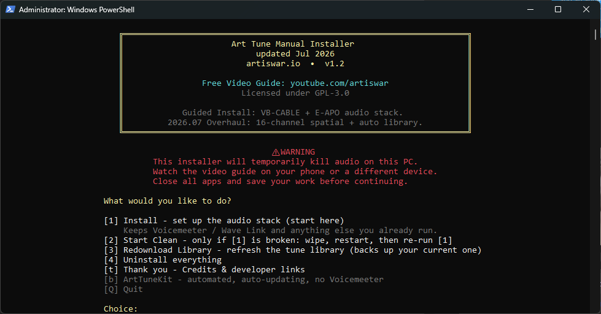

<p align="center">
  
</p>

<p align="center">
  <a href="LICENSE"></a>
  <a href="library/LICENSE"></a>
  
</p>

# SonicScout2.0

Free, open-access database of game audio EQ profiles, HeSuVi configurations, and HRIR files.

See also: [LEQ Control Panel](https://github.com/sensoredrooster/LEQControlPanel) - companion app for managing LEQ state and release time on SonicScout2.0 devices.

Check out [www.github.com/sensoredrooster](https://www.github.com/sensoredrooster) for the latest audio guides.

<p align="center">
  
</p>

## Requirements

- Windows 10 or 11 (x64 only -- ARM64 not supported)
- **Windows PowerShell 5.1.** PowerShell 7 is not supported and the installer will refuse to run under it. Setup needs BITS, AppX and PnP components that PowerShell 7 cannot load. Open "Windows PowerShell", not "PowerShell 7" or "Terminal" set to pwsh
- Administrator privileges (required for audio driver and registry operations)
- Internet connection (the installer downloads the audio tools and the tune library)

## Install

Open an **elevated** (Run as Administrator) **Windows PowerShell** window and run:

```powershell
irm https://raw.githubusercontent.com/sensoredrooster/SonicScout2.0/main/powershell/Install-SonicScout2.0.ps1 | iex
```

Or run locally:

```powershell
powershell -ExecutionPolicy Bypass -File Install-SonicScout2.0.ps1
```

The main menu offers:

| Option | What it does |
|--------|--------------|
| `[1] Install` | Sets up the audio stack. Start here. Keeps Voicemeeter, Wave Link and anything else you already run |
| `[2] Start Clean` | Only if `[1]` is broken. Wipes, restarts, then you re-run `[1]` |
| `[3] Redownload Library` | Refreshes the tune library. Backs up your current one first |
| `[4] Uninstall everything` | Removes the installed components. Prompts for a restart |
| `[5] Setup Profile` | Selects a game, version, real bundled tune, and EQ file, then activates it |
| `[t] Thank you` | Credits and developer links |
| `[b] SonicScout2.0` | Opens the page for the automated, auto-updating app |
| `[Q] Quit` | Exit |

The script writes the Equalizer APO starter chain and `[5] Setup Profile` activates real library files. Routing, channel format, mixer routing, and LEQ setup remain guided Windows steps covered by the [video guide](https://www.github.com/sensoredrooster).

## What the installer does

`[1] Install` runs nine steps:

1. **VB-CABLE** - the virtual audio cable the whole chain routes through
2. **Voicemeeter** - only when you need it. Skipped if you already run Elgato Wave Link or a paid Voicemeeter edition, so your existing mixer is left alone
3. **ReaPlugs** - the VST host and effects the tunes use
4. **Audio endpoints** - names and icons for the three devices below. Setup does not set the channel formats; that is a manual step covered in the [video guide](https://www.github.com/sensoredrooster)
5. **Equalizer APO**, then the tune library, fetched automatically
6. **HeSuVi** - virtual surround via HRIR convolution
7. **HRIR files**, then a starter `config.txt`
8. **JSFX plugins** and the **SS Spatial Engine Bravo** VST DLLs
9. **LEQ Control Panel**

### Audio endpoints

VB-CABLE provides three endpoints, renamed and given icons during setup:

| Endpoint | Role |
|----------|------|
| **SonicScout2.0** | 8-channel render. Used by every tune up to BO7 V4 |
| **SonicScout2.0 +** | 16-channel render. Used by BO7 V5 and later |
| **SonicScout2.0 Unified Output** | Capture. What your own audio app records from |

Setup also sets the **SonicScout2.0** endpoint's speaker configuration to 7.1 Surround automatically -- no manual Configure step in Sound settings. The 16-channel endpoint is left at its driver default.

Select **SonicScout2.0** or **SonicScout2.0 +** as the output device in game, matching the tune you are running.

When setup installs Voicemeeter Standard, its two endpoints are renamed as well -- **Voicemeeter Input** becomes **Normal Audio** and **Voicemeeter Out B1** becomes **Virtual Mix**, so they match the names the game settings pages ask for. Banana and Potato are left alone, as is any mixer you chose to keep instead of Voicemeeter.

### The tune library

The library is downloaded and extracted for you during step 5, and `[3] Redownload Library` refreshes it later. There is no manual download-and-drag step.

Releases are also published on the [Releases](https://github.com/sensoredrooster/SonicScout2.0/releases) page if you want to inspect one. The release zip has its payload at the zip root -- the game folders, `jsfx/`, `vst/` and `version.txt` sit directly inside it, with no wrapping `library/` folder.

## The SonicScout2.0 folder

Setup creates `C:\Program Files\EqualizerAPO\config\SonicScout2.0\` and a desktop shortcut to it:

| Item | Purpose |
|------|---------|
| `SonicScout2.0 Home.url` | Opens the developer's GitHub page |
| `SonicScout2.0.url` | Opens the SonicScout2.0 GitHub |
| `E-APO Configuration Editor.lnk` | Opens the Equalizer APO Configuration Editor |
| `LEQ Control Panel.lnk` | Launches LEQ Control Panel |
| `README.txt` | Quick reference for the folder contents |
| `boost.txt` | Optional output boost. A single `Preamp` line, included last on every chain so it acts as a true output gain. Ships seeded at `0 dB`, which is off. Setup writes it once and never overwrites it, so your value survives later runs |
| `active-config\` | The live files selected by `[5] Setup Profile` |
| `library\` | The static tune library |

## Library structure

The library is organised by game, then by **version** (`V0`, `V1`, `V3`...). Versions are not game seasons: a tune is a tune, and the numbering no longer pretends to track a season.

```
library/
  BF6_SETTINGS.md        Battlefield 6 in-game audio settings
  COD_SETTINGS.md        Call of Duty in-game audio settings (BO6/BO7/Warzone)
  changelog.txt          What changed in each library release
  version.txt            Release stamp
  BF6/        V0  V1
  BO6/        V6
  BO7/        V0  V3  V4 (super beta)  V5
  PS5-BO6/    V6
  jsfx/                  SS JSFX plugins
  vst/                   SS Spatial Engine Bravo VST DLLs
  measurements/          Headphone measurements for models not on squig.link
```

A typical game/version folder, using BO7 V3:

```
library/BO7/V3/
  BO7_V3.lnk                        HeSuVi preset shortcut
  BO7_V3_pre.txt                    Pre-HeSuVi processing (7.1 channel)
  BO7_V3_post.txt                   Post-HeSuVi processing (stereo)
  BO7_Target_V3.txt                 Target curve for squig.link
  LEQ - Release Time 2 (Insta).txt  Recommended LEQ release time
  Edit E-APO Config.lnk             Opens the E-APO Configuration Editor
  GadgetryTech SquigLink.url        Opens gadgetrytech.squig.link
  eq/
    Flat_EQ.txt                     Fallback EQ, target only, no headphone correction
    (save your own squig.link EQ here)
```

| File | Purpose |
|------|---------|
| `*.lnk` | HeSuVi preset shortcut. Launch it to load the matching HeSuVi profile |
| `*_pre.txt` | Pre-HeSuVi processing chain (7.1 channel). Loaded before HeSuVi in `config.txt` |
| `*_post.txt` | Post-HeSuVi processing chain (stereo shaping). Loaded at the very end |
| `*_Target_*.txt` | Target curve. Upload to squig.link to generate a headphone-specific EQ |
| `LEQ - *.txt` | A note giving the recommended LEQ setting for this tune |
| `eq/` | Your headphone EQ files. Save squig.link Auto EQ results here |
| `eq/Flat_EQ.txt` | Fallback that applies the target with no headphone-specific correction |

`Flat_EQ.txt` is shared across every game and version. The old per-game `TargetOnly_*.txt` files are retired.

The `measurements/` folder holds frequency response data for headphones not widely available on squig.link. Upload one alongside a target curve to generate a matched EQ for an unlisted model.

## BO7 V5: 16-channel tunes

BO7 V5 is the first 16-channel release. The SS Spatial Engine runs the whole chain natively on the **SonicScout2.0 +** endpoint, so **there is no HeSuVi stage** and no `_pre`/`_post` pair. You point one `Include:` line at one config file.

V5 ships 20 configs: five tuning styles, each at four self-gun levels.

| Style | Character |
|-------|-----------|
| **Full** | Combat ducking off, footsteps lifted, full dynamics |
| **Capped** | Full with a soft ceiling that rounds off the loudest peaks |
| **Balanced** | Full's footstep lift with combat control kept on |
| **Competitive** | Maximum footstep detail |
| **Immersive** | The easy listen. Guns tamed deepest, smoothest presence |

Each style has a **self gun level** of `StockGun`, `LoGun`, `MedGun` or `HiGun`, controlling how much of your own gunfire stays in the mix. Files are named `BO7_V5_16ch_<Style>-<Level>Gun.txt`.

`library/BO7/V5/Choose a 16ch Tune.txt` describes every combination and names the exact file to use. Read that before picking.

BO7 V5 carries no LEQ note because the 16-channel path does not use Loudness Equalization.

## BO7 V4 - SUPER BETA, EXPERIMENTAL

> **BO7 V4 is SUPER BETA and EXPERIMENTAL. It is not a finished tune, and it is not the recommended way to play.**

V4 ships so people who want to experiment can try it and send feedback. Treat it as a work in progress:

- Its pre-HeSuVi chain dates from **October 2025** and predates all of the V5 work
- There is **no post chain** -- `BO7_V4_post.txt` is an intentional empty placeholder
- **LEQ is disabled** for this profile (`LEQ - OFF.txt`)
- It runs the older **Bravo v1.0.2** VST, not the v2.0.0 engine that drives V5

For the current BO7 tune, use **V5** (16-channel, `SonicScout2.0 +`) or **V3** (8-channel, `SonicScout2.0`).

## BO7 V3 tune variations

BO7 V3 ships four pre-HeSuVi variations. All four use the same Spatial Engine and Stereo Enhancer, tuned differently:

| Variation | File | Description |
|-----------|------|-------------|
| **Competitive** (default) | `BO7_V3_pre.txt` | Aggressive suppression, heavy noise removal, maximum footstep separation |
| **Clean** | `BO7_V3_pre_clean.txt` | Lighter processing, more natural spatial image |
| **Streamer** | `BO7_V3_pre_streamer.txt` | Gun stays punchy, environment has presence |
| **Ultra** (experimental) | `BO7_V3_pre_ultra.txt` | Maximum footstep extraction, everything cranked |

Run `[5] Setup Profile` to choose the variation and EQ. The wizard copies the selected real pre/post or 16-channel tune into `active-config\`, validates the EQ filter text, and leaves the static library untouched. Choose `C` at the EQ prompt to import a custom SquigLink/Equalizer APO text export.

## Configuration

Setup writes a starter `config.txt` to `C:\Program Files\EqualizerAPO\config\config.txt`. Its two device-scoped chains point to `SonicScout2.0\active-config\`. Use `[5] Setup Profile` to select the real game/version/tune/EQ files; do not edit the managed Include lines by hand.

**Both chains are written live.** Each is scoped to its own output device with a `Device:` line carrying that endpoint's GUID, so Equalizer APO applies whichever chain matches the device you are actually playing through:

| Device line | Chain |
|-------------|-------|
| `Device: SonicScout2.0 VB-Audio Virtual Cable {guid}` | 8-channel, uses HeSuVi |
| `Device: SonicScout2.0 + VB-Audio Virtual Cable {guid}` | 16-channel, no HeSuVi, needs the bundled VST |

Do not comment either one out. Switch between them by picking the output device in Windows.

The 16-channel section is written only when both endpoints resolved during setup. If the **SonicScout2.0 +** endpoint was missing, you get an 8-channel-only `config.txt`; re-run setup to add the other chain.

### 8-channel tunes (everything up to BO7 V4)

Order matters: pre, HeSuVi, EQ, post, boost.

```
# ---- 8ch profile (SonicScout2.0) ----
Device: SonicScout2.0 VB-Audio Virtual Cable {guid}
# PRE HESUVI
Include: SonicScout2.0\active-config\prehesuvi.txt
# DO NOT REMOVE HESUVI #
Include: HeSuVi\hesuvi.txt
# EQ
Include: SonicScout2.0\active-config\eq.txt
# POST HESUVI
Include: SonicScout2.0\active-config\posthesuvi.txt
# OUTPUT BOOST
Include: SonicScout2.0\active-config\boost.txt
```

Do not remove the HeSuVi comment or its include line.

### 16-channel tunes (BO7 V5)

One tune file, no HeSuVi:

```
# ---- 16ch profile (SonicScout2.0 +) ----
Device: SonicScout2.0 + VB-Audio Virtual Cable {guid}
# 16ch TUNE
Include: SonicScout2.0\active-config\16chConfig.txt
# EQ
Include: SonicScout2.0\active-config\eq.txt
# OUTPUT BOOST
Include: SonicScout2.0\active-config\boost.txt
```

Only use files with `_16ch_` in the name on the tune line.

### Output boost

`SonicScout2.0\boost.txt` is included **last on both chains**, so it lands after all other processing and acts as a true output gain. It is one file shared by both. Set your dB there; it ships at `0 dB`, which is off. Equalizer APO reloads it live, so no restart is needed.

## Headphone EQ

To generate an EQ matched to your headphone:

1. Open `GadgetryTech SquigLink.url` in the game/version folder
2. Upload the target file (for example `BF6_Target_V0.txt`) in the **EQ** tab on the left
3. Search for your headset or IEM
   - Not listed? Check the `measurements/` folder for your model and upload that alongside the target
   - Still nothing? Use `eq/Flat_EQ.txt` directly. It applies the target with no headphone correction. Better than no EQ, but not as accurate as a matched profile
4. Hit **Auto EQ**
5. Save the result as `YourHeadphone_BO7_V3.txt`, matching the game and version
6. Put the file in that version's `eq/` subfolder, or choose `C` in `[5] Setup Profile` and provide its full path

The wizard accepts standard Equalizer APO parametric exports containing `Preamp:` and
`Filter N: ON ...` lines. It rejects files with no supported filters before changing the
active profile.

## In-game settings

Each game needs specific in-game audio settings for the chain to work. Reference files live in the library root:

| File | Covers |
|------|--------|
| `library/BF6_SETTINGS.md` | Battlefield 6 -- Volume Mixer routing, 7.1 Surround, volume levels, audio mix |
| `library/COD_SETTINGS.md` | Black Ops 7, Black Ops 6, Warzone -- device selection (**SonicScout2.0** for V0-V4, **SonicScout2.0 +** for V5), Speaker Output on **Windows Default**, Enhanced Headphone Mode off |

Apply these before playing. The wrong output device, the wrong Speaker Output setting, or Enhanced Headphone Mode left on will bypass or break the chain.

The Speaker Output value differs by game, so use the file rather than assuming. Battlefield 6 wants **7.1 Surround**. Call of Duty wants **Windows Default**, which lets the game follow the format of whichever endpoint it is playing to -- 8-channel on **SonicScout2.0**, 16-channel on **SonicScout2.0 +**. Forcing a fixed layout there overrides that and breaks the routing.

## HRIR files

The installer downloads two HRIR presets, each at both sample rates, into `C:\Program Files\EqualizerAPO\config\HeSuVi\hrir\`:

| Preset | Sample rates |
|--------|--------------|
| `EAC_Default.wav` | 48 kHz and 44.1 kHz |
| `EAC_Refined.wav` | 48 kHz and 44.1 kHz |

The `hrir/` folder in this repo holds `EAC_Default.wav` at both rates for reference. To add it by hand, copy the folder contents into the HeSuVi `hrir\` directory above.

## JSFX and VST plugins

Setup installs both plugin sets in step 8. There is no separate menu item for them.

**JSFX**, installed to `C:\Program Files\VSTPlugins\ReaPlugs\JS\Effects\SonicScout2.0\`:

- **SS Spatial Engine** (`ss_spatial_engine.jsfx`) -- processes raw 7.1 game audio before HeSuVi. Separates footsteps from gunfire and ambience across all surround channels, suppresses your own sounds, and adapts to the scene. 59 parameters
- **SS Stereo Spatial Enhancer** (`ss_stereo_spatial_enhancer.jsfx`) -- processes stereo output after HeSuVi. Cleans up crossfeed bleed from HRIR convolution, keeps bass centred, widens the field. 7 parameters

**VST**, installed to `C:\Program Files\VSTPlugins\SonicScout2.0\`:

- **SS Spatial Engine Bravo** (`ss_spatial_engine_bravo_v1.0.2.dll`, `ss_spatial_engine_bravo_v2_0_0.dll`) -- the native engine. v2.0.0 drives the 16-channel BO7 V5 path

BO7 V3 needs the JSFX plugins. BO7 V4 and V5 need the VST.

## Release naming

Releases use CalVer with a label. They track library work, not game seasons.

**Format:** `YYYY.MM[.patch]-Label`

**Examples:**

- `2026.02-InitialRelease`
- `2026.04-AvalonEraRevamp`
- `2026.04.1-AvalonEraRevampV2` - patch release on the same label
- `2026.07-Overhaul`
- `2026.07.1-Overhaul` - current

The stamp for the shipped library is in `library/version.txt`, and `library/changelog.txt` records what changed in each one.

## Third-Party Software

| Software | Purpose | License | Link |
|----------|---------|---------|------|
| [Equalizer APO](https://sourceforge.net/projects/equalizerapo/) | System-wide audio processing engine | GPL-2.0 | [SourceForge](https://sourceforge.net/projects/equalizerapo/) |
| [HeSuVi](https://sourceforge.net/projects/hesuvi/) | Virtual surround (HRIR convolution) for headphones | GPL-2.0 | [SourceForge](https://sourceforge.net/projects/hesuvi/) |
| [ReaPlugs](https://www.reaper.fm/reaplugs/) | VST audio plugins (compressor, EQ, limiter) | Freeware (REAPER license) | [reaper.fm](https://www.reaper.fm/reaplugs/) |
| [VB-CABLE](https://vb-audio.com/Cable/) | Virtual audio cable for routing | Donationware | [vb-audio.com](https://vb-audio.com/Cable/) |
| [Voicemeeter](https://vb-audio.com/Voicemeeter/) | Virtual audio mixer, installed only when needed | Donationware | [vb-audio.com](https://vb-audio.com/Voicemeeter/) |
| [LEQ Control Panel](https://github.com/sensoredrooster/LEQControlPanel) | Manages LEQ state and release time on SonicScout2.0 devices | GPL-3.0 | [GitHub](https://github.com/sensoredrooster/LEQControlPanel) |
| SS Spatial Engine Bravo (VST) | Native spatial audio processing engine (8ch / 16ch) | Proprietary (binary-only) | [LICENSE](library/vst/LICENSE) |

These tools are downloaded during installation and are subject to their own license terms.
SonicScout2.0 does not bundle or redistribute the third-party tools -- they are fetched from their official sources at install time.

Earlier versions of the stack used VB-Audio Hi-Fi Cable. It has been retired: setup now removes it and installs VB-CABLE instead.

### HRIR Attribution

The **EAC_Default.wav** HRIR preset was generated using [Individualized HRTF Synthesis](https://github.com/davircarvalho/Individualized_HRTF_Synthesis) by Davi Carvalho (Federal University of Santa Maria, Brazil). The synthesis tool is licensed under GPL-3.0. The generated HRIR output (`.wav` file) is redistributed as data, not as a derivative of the tool's source code.

## License

Copyright (C) 2026 SonicScout2.0, LLC.

This repository carries several licences. Coverage by path:

| Path | Licence |
|------|---------|
| `powershell/` | [GPL-3.0](LICENSE) |
| `library/` | [CC BY-NC-SA 4.0](library/LICENSE), except the two paths below |
| `library/jsfx/` | [MIT](library/jsfx/LICENSE) |
| `library/vst/` | Proprietary, binary-only. See [library/vst/LICENSE](library/vst/LICENSE) |
| `jsfx/` | [MIT](jsfx/LICENSE) |
| `Assets/` | Screenshots and icons, (C) 2026 SonicScout2.0, LLC |
| `hrir/` | Generated output. See [HRIR Attribution](#hrir-attribution) |
| Root documentation | (C) 2026 SonicScout2.0, LLC |

See each LICENSE file for full terms.
